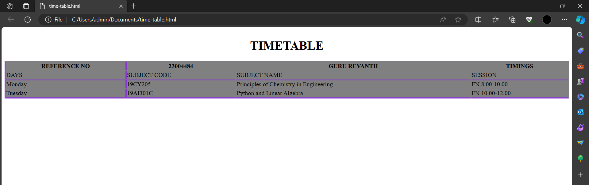

# Ex-04-Timetable
## AIM
To Write a html webpage page to display your timetable.

# ALGORITHM
### STEP 1
create a simple table using table tag
### STEP 2
Add header row using th tag
### STEP 3
Add your timetable
### STEP 4
Execute the program

# CODE
```
<br>
<style>
    table,th,td{
        border:1px solid blueviolet;
        background-color:gray;
        
    }
</style>
<body>
    <h1><center>TIMETABLE</center></h1>
    <table style="width:100%;">
    <tr>
        <th>REFERENCE NO</th>
        <th>23004484</th>
        <th>GURU REVANTH</th>
        <th>TIMINGS</th>
    </tr>
<tr>
    <td>DAYS</td>
    <td>SUBJECT CODE</td>
    <td>SUBJECT NAME</td>
    <td>SESSION</td>
</tr>
<tr>
    <td>Monday</td>
    <td>19CY205</td>
    <td>Principles of Chemistry in Engineering</td>
    <td>FN 8.00-10.00</td>
</tr>
<tr>
    <td>Tuesday</td>
    <td>19AI301C</td>
    <td>Python and Linear Algebra</td>
    <td>FN 10.00-12.00</td>

</tr></table>

</body>
```

# OUPUT

# result
Thus the desire time table created.
